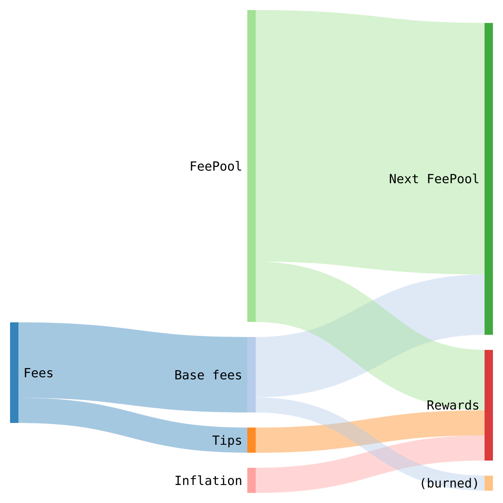

# Stakeholder rewards

## General overview

Every block produced by the consensus process, although including votes from a quorum of stakeholders, has a single stakeholder as its **block proposer**. Block proposers are assigned randomly in proportion to stakeholders' voting power. For example, a stakeholder with 20,000 lents staked would be a proposer about twice as often as a stakeholder with 10,000 lents.

Proposers claim **rewards** using a special transaction within blocks they propose. Stakeholders with larger shares of stake will have proportionately more chances to claim rewards, and thus stakes can be thought of as shares in the claimable rewards.

Rewards come from three sources:

* **Met inflation**: each block, 1 TMET is created and claimed by the proposer. This acts as a tax on unstaked mets, mildly discouraging passive met holding.
* **Base fees**: the protocol specifies a dynamically adjusting minimum transaction fee, similar in spirit to [EIP-1559](https://github.com/ethereum/EIPs/issues/1559), to prevent congestion and vastly simplify fee calculation. 87.5% of these fees are deposited into a "fee pool", of which the proposer can claim 0.097% per block; the remaining 12.5% is burned. The effect is to redistribute the mandatory fees of a transaction to all stakeholders, regardless of which stakeholder proposes it into the blockchain.
* **Tips**: transactions can include fees above and beyond the protocol-mandated minimum. These fees go entirely to the proposer of the block that includes the transaction and incentivizes proposers to actually include transactions instead of making empty blocks to free-ride off of inflation and fee-pool withdrawals.

## Specifications

### Reward transaction

Each transaction has exactly one **reward transaction**. It:

* Has `Kind == KindReward` 
* Has no inputs
* Has `Data` be an RLP-encoded block height
* Three outputs with any constraint:
  * `Outputs[0]`: 1 TMET
  * `Outputs[1]`: `FeePool >> 10` 
  * `Outputs[2]`: total amount of TMEL tips

The reward transaction is processed after all other transactions in the block. 

### Fee burning

When each transaction is processed, the field `FeePool` of the blockstate is incremented by`BaseFee - BaseFee >> 3`. We burning 1/8 of the base fee to gradually reduce the supply of mels, generating demand for mel minting in a steady-state economy.

Why not burn all of the base fee as in EIP-1559? There are two separate reasons:

* Burning all the base fees causes perverse incentives for "benign" stakeholder cartels to damage usability of other users to enrich themselves. These cartels follow the protocol honestly, but nevertheless can coordinate their actions --- the largest Bitcoin and Ethereum mining pools are almost certainly cartels in this sense. As a simple example, a cartel can vote up MaxWeight indefinitely, make MinFee go to zero, and censor transactions that don't pay a certain fee. The cartel can then capture much of the value that would otherwise be burnt, at the cost of forcing users to participate in Bitcoin-like fee auctions, harming usability.
* Distributing most of the fees to stakeholders gives a stable cash flow to staked mets. This means mets are basically stocks paying dividends based on "earnings" related to the aggregate value Themelio provides to people. Mets would be very valuable, and the TMET market cap would be a good approximation of how much Themelio is worth. This is necessary for proof-of-stake security.

### But what about cartels?

Themelio's protocol has a monopoly on selling Themelio block space, a good with no perfect substitutes. This means that stakeholder cartels have a strong incentive to vote down MaxWeight to jack up MinFee. The result would be fees noticeably higher than the ideal, Marshall-optimal level. Will this cause Themelio to become too expensive to use?

Not really. Such behavior is really no different from Visa's shareholders voting to increase fees. Stakeholders by definition have substantial long positions in TMET and therefore the future value of Themelio. Like shareholders in a payment processing company, they are incentivized to target a MaxWeight that maximizes future revenue, but no more --- at some point, further price increases drive away users and lower revenues. Considering that the long-run demand elasticity of blockchain space is pretty high, the revenue-maximizing fee level is probably only slightly higher than the socially optimal level.

The key insight behind the fee-adjusting algorithm is in fact that by giving this cartelization pressure a protocol-sanctioned "outlet", we can harness it to stabilize fees, simplify user experience, and increase PoS security. 

